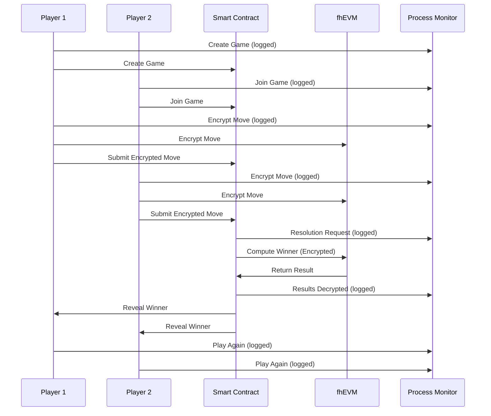

<div align="center">

# 🪨📄✂️ Encrypted Rock Paper Scissors

**A privacy-preserving Rock Paper Scissors game powered by Zama's fhEVM technology**

[](https://rps-fhe.vercel.app/)
[](https://nextjs.org/)
[](https://docs.zama.ai)
[](https://sepolia.etherscan.io/address/0x19AC891d6d1c91fb835d87Aef919C2F199c0E469)

[🎮 **Play Now**](https://encrypted-rock-paper-scissors.vercel.app) • [📖 **Documentation**](#how-it-works) • [🚀 **Deploy**](#deployment)

</div>

---

## 🔐 What Makes This Special?

This isn't your ordinary Rock Paper Scissors game. Built with **Zama's Fully Homomorphic Encryption (FHE)**, this game ensures complete privacy and fairness:

- 🔒 **Your moves stay secret** until both players commit
- ⚡ **On-chain computation** without revealing private data
- 🛡️ **Zero-knowledge proofs** guarantee valid moves
- 🎯 **Provably fair** gameplay with cryptographic guarantees
- 📊 **Live process monitoring** to understand FHE operations
- 🎮 **Enhanced user experience** with real-time feedback

## ✨ Latest Features (v2.0)

### 🖥️ **Game Process Monitor**
- **Live activity tracking** showing the complete game journey
- **Real-time FHEVM operations** logging (encryption, decryption, proofs)
- **Blockchain interaction monitoring** (game creation, moves, resolution)
- **Permanently visible** on all pages for transparency
- **Filtered logging** showing only relevant game events

### 🏆 **Enhanced Game Results**
- **Prominent winner announcements** with emojis and clear messaging
- **Detailed result breakdown** showing game outcome
- **Play Again button** for seamless game restart
- **Game state persistence** across page refreshes
- **Comprehensive status tracking** from creation to completion

### 🎨 **Improved User Interface**
- **Simplified navigation** with removed clutter
- **Better visual feedback** for all game states
- **Responsive design** optimized for all devices
- **Clear status indicators** throughout the game flow
- **Enhanced error handling** with user-friendly messages

## 👥 How to Play (Opponent System)

This game is designed for **two human players** to compete against each other:

### 🎮 **Game Flow:**
1. **Player 1** creates a new game and gets a **Game ID**
2. **Player 1** shares the Game ID with **Player 2** (friend, colleague, etc.)
3. **Player 2** joins the game using the Game ID
4. Both players **encrypt their moves** using FHE
5. **Smart contract** determines the winner using encrypted computation
6. **Results are revealed** to both players with clear winner announcements

### 🤝 **Finding Opponents:**
- **Friends & Family**: Share Game IDs with people you know
- **Colleagues**: Challenge coworkers during breaks
- **Social Media**: Post Game IDs on Twitter/Discord
- **Gaming Communities**: Join crypto gaming groups
- **Tournaments**: Organize competitions with Game ID sharing

## 🎯 How It Works



### Step-by-Step Process:

1. **🎮 Game Creation**: Player 1 creates a new game on-chain
2. **🤝 Join Game**: Player 2 joins the existing game
3. **🔒 Encrypt Moves**: Both players encrypt their moves using FHE
4. **📤 Submit Moves**: Encrypted moves are submitted to the contract
5. **⚡ Compute Winner**: Contract determines winner using FHE operations
6. **🏆 Reveal Result**: Winner is revealed to both players with enhanced UI
7. **🔄 Play Again**: Seamless restart for new games

## 🛠️ Technology Stack

<table>
<tr>
<td align="center" width="25%">

### 🎨 **Frontend**
- Next.js 15
- React 19
- TypeScript
- Tailwind CSS
- Radix UI
- Custom Debug Panel

</td>
<td align="center" width="25%">

### ⛓️ **Blockchain**
- Solidity 0.8.24
- Hardhat
- Viem/Ethers.js
- Sepolia Testnet
- FHEVM v0.8.1

</td>
<td align="center" width="25%">

### 🔐 **Encryption**
- Zama fhEVM
- Fully Homomorphic Encryption
- Zero-Knowledge Proofs
- Encrypted Types (euint8, ebool)
- Relayer Integration

</td>
<td align="center" width="25%">

### 🚀 **Deployment**
- Vercel
- GitHub Actions
- Sepolia Network
- Environment Variables
- Public RPC

</td>
</tr>
</table>

## 🏗️ Smart Contract Architecture

The `RockPaperScissors.sol` contract leverages fhEVM's powerful encrypted computation:

```solidity
// Encrypted move types
euint8 encryptedMove1;  // Player 1's encrypted move
euint8 encryptedMove2;  // Player 2's encrypted move

// FHE operations for winner determination
ebool isDraw = FHE.eq(move1, move2);
ebool player1Wins = FHE.or(rockBeatsScissors, paperBeatsRock, scissorsBeatsPaper);
```

### Key Features:
- 🔢 **Encrypted Types**: `euint8` for moves, `ebool` for comparisons
- 🧮 **FHE Operations**: `FHE.eq`, `FHE.and`, `FHE.or` for computations
- 🛡️ **Input Validation**: Zero-knowledge proofs for move verification
- 🔐 **Access Control**: Permission-based encrypted data access
- 🚫 **Duplicate Prevention**: Prevents multiple resolution requests

## 🚀 Quick Start

### Prerequisites
- Node.js 18+ (LTS version)
- MetaMask or Web3 wallet
- Sepolia ETH ([Get from faucet](https://sepoliafaucet.com/))

### Installation

```bash
# Clone the repository
git clone https://github.com/GoJackzi/RockPaperScissors.git
cd RockPaperScissors

# Install dependencies
npm install --legacy-peer-deps

# Run development server
npm run dev
```

### Environment Setup

Create a `.env.local` file:

```env
# FHEVM v0.8.1 Configuration - Sepolia
NEXT_PUBLIC_FHEVM_RELAYER_URL=https://relayer.testnet.zama.cloud
NEXT_PUBLIC_SEPOLIA_RPC_URL=https://eth-sepolia.g.alchemy.com/v2/YOUR_ALCHEMY_KEY
NEXT_PUBLIC_CONTRACT_ADDRESS=0x19AC891d6d1c91fb835d87Aef919C2F199c0E469
NEXT_PUBLIC_CHAIN_ID=11155111
```

## 🔗 Contract Information

| Property | Value |
|----------|-------|
| **Contract Address** | [`0x19AC891d6d1c91fb835d87Aef919C2F199c0E469`](https://sepolia.etherscan.io/address/0x19AC891d6d1c91fb835d87Aef919C2F199c0E469) |
| **Network** | Sepolia Testnet |
| **Chain ID** | 11155111 |
| **Compiler** | Solidity 0.8.24 |
| **EVM Version** | Cancun |
| **FHEVM Version** | v0.8.1 |

## 📚 Available Scripts

```bash
# Development
npm run dev          # Start development server
npm run build        # Build for production
npm run start        # Start production server

# Smart Contracts
npm run compile      # Compile contracts
npm run deploy:contract  # Deploy to Sepolia

# Utilities
npm run lint         # Run ESLint
```

## 🌐 Live Demo

**[🎮 Play the game live!](https://encrypted-rock-paper-scissors.vercel.app)**

- Switch to Sepolia network in MetaMask
- Get Sepolia ETH from a faucet
- Create or join a game
- Watch the Game Process Monitor for live FHE operations
- Experience privacy-preserving gameplay!

## 🔍 fhEVM Integration

This project showcases the power of Zama's fhEVM:

### Encrypted Types
```solidity
euint8 encryptedMove;     // Encrypted 8-bit integer
ebool comparison;         // Encrypted boolean
externalEuint8 input;     // External encrypted input
```

### FHE Operations
```solidity
// Equality check
ebool isEqual = FHE.eq(move1, move2);

// Logical operations
ebool result = FHE.and(condition1, condition2);
ebool winner = FHE.or(option1, option2);
```

### Access Control
```solidity
// Grant permission to view encrypted data
FHE.allowTransient(encryptedData, userAddress);
```

## 🚀 Deployment

### Vercel Environment Variables

For Vercel deployment, add these environment variables in your Vercel dashboard:

```env
NEXT_PUBLIC_FHEVM_RELAYER_URL=https://relayer.testnet.zama.cloud
NEXT_PUBLIC_SEPOLIA_RPC_URL=https://eth-sepolia.g.alchemy.com/v2/YOUR_ALCHEMY_KEY
NEXT_PUBLIC_CONTRACT_ADDRESS=0x19AC891d6d1c91fb835d87Aef919C2F199c0E469
NEXT_PUBLIC_CHAIN_ID=11155111
```

**Important Notes:**
- Replace `YOUR_ALCHEMY_KEY` with your actual Alchemy API key
- All variables must be prefixed with `NEXT_PUBLIC_` for client-side access
- The contract address is the latest deployed version on Sepolia

### Deployment Steps

1. **Connect GitHub**: Link your GitHub repository to Vercel
2. **Add Environment Variables**: Use the variables above in Vercel dashboard
3. **Deploy**: Vercel will automatically deploy on every push to main
4. **Verify**: Test the deployed app with Sepolia network

## 🤝 Contributing

We welcome contributions! Please see our contributing guidelines:

1. Fork the repository
2. Create a feature branch (`git checkout -b feature/amazing-feature`)
3. Commit your changes (`git commit -m 'Add amazing feature'`)
4. Push to the branch (`git push origin feature/amazing-feature`)
5. Open a Pull Request

## 📖 Learn More

- [Zama fhEVM Documentation](https://docs.zama.ai/fhevm)
- [Fully Homomorphic Encryption](https://en.wikipedia.org/wiki/Homomorphic_encryption)
- [Next.js Documentation](https://nextjs.org/docs)
- [Tailwind CSS](https://tailwindcss.com/docs)

## 📄 License

This project is licensed under the MIT License - see the [LICENSE](LICENSE) file for details.

## 🙏 Acknowledgments

- [Zama](https://zama.ai) for the amazing fhEVM technology
- [Vercel](https://vercel.com) for seamless deployment
- [Next.js](https://nextjs.org) team for the incredible framework
- [Tailwind CSS](https://tailwindcss.com) for beautiful styling

---

<div align="center">

**Built with Agape ❤️ for Zama**

[](https://github.com/GoJackzi/RockPaperScissors)
[](https://x.com/tardhus)

</div>
